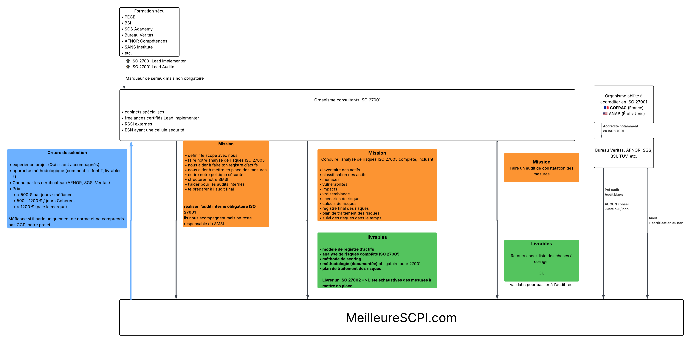

# **Pilotage Sécurité — Document de Référence Global**

**MeilleureSCPI.com — 2025**

---

## **1. Contexte & Objectifs**

MeilleureSCPI.com est une fintech spécialisée dans la donnée, l’agrégation SCPI et la gestion de patrimoines.
Notre activité repose sur :

* des applications web (VueJS),
* un backend (Symfony),
* des données sensibles clients & financières,
* des services SaaS critiques (Google, GitHub, Dashlane, Datakeen…),
* un mode de travail hybride / télétravail,
* une montée en complexité (LLM, CI/CD, API externes…).

Les objectifs du projet **Pilotage Sécurité** sont :

* Réaliser une **analyse des risques complète** du SI,
* Obtenir un **plan d’action priorisé et actionnable**,
* Mettre en place un **accompagnement concret** fourni par un prestataire,
* Définir une **gouvernance sécurité pérenne** (ISO 27001 light),
* Structurer les bonnes pratiques internes.

Ce document regroupe toutes les phases du projet, la recherche du prestataire, les workflows ISO, et le cahier des charges associé.

---

## **2. Workflow global**



---

# **3. Phase 0 — Recherche & Qualification des prestataires**

## **3.1 Objectif**

[Recherche profiles MALT](https://www.malt.fr/s?q=s%C3%A9curit%C3%A9+iso+27001&sourceComponent=advanced_search_dispatch)

Identifier **3 à 5 prestataires pertinents avant de finaliser notre périmètre interne**.
Cela permet :

* de valider la faisabilité et les méthodologies proposées,
* d’éviter de sur-spécifier le périmètre sans expertise,
* de filtrer rapidement les prestataires non adaptés,
* d’ajuster ensuite notre périmètre théorique.

---

## **3.2 Mail type à envoyer**

*(La section suivante est laissée inchangée mais présentée proprement.)*

```markdown
# Objet : Demande d’information – Accompagnement Sécurité & Analyse des Risques

Bonjour,

Je vous contacte dans le cadre d’un projet d’amélioration de la sécurité au sein de MeilleureSCPI.com, société fintech spécialisée dans les données et investissements SCPI.

Nous recherchons un prestataire capable de nous accompagner sur :

• une analyse des risques complète de notre système d’information,  
• la proposition d’une méthodologie adaptée (à votre choix),  
• la fourniture d’un plan d’action priorisé et actionnable,  
• un accompagnement à la mise en œuvre des mesures retenues  
  (nous ne recherchons pas un simple audit documentaire).

Vous trouverez ci-joint un cahier des charges synthétique présentant notre contexte et nos attentes.

## Informations attendues dans un premier retour

1. Votre compréhension du besoin  
2. Votre méthodologie (ISO 27005, EBIOS RM, interne, hybride…)  
3. Vos livrables habituels  
4. Votre capacité d’accompagnement  
5. Certifications & compétences  
6. Références PME / Fintech / SaaS  
7. Estimation du périmètre optimal  
8. Contraintes éventuelles  

## Informations importantes

• L'analyse initiale se fait uniquement sur votre réponse écrite.  
• Les prestataires retenus auront un échange visio de 30–45 min.  
• Le devis sera demandé seulement après validation du périmètre final.  
• Toute information non fournie sera considérée comme non fournie.

## Étapes suivantes

1. Analyse de votre réponse  
2. Sélection de 2–3 prestataires  
3. Finalisation du périmètre  
4. Demande de devis  
5. Sélection finale

Merci pour votre retour.
```

---

## **3.3 Réponse attendue des prestataires**

1. Compréhension du besoin
2. Méthodologie détaillée
3. Livrables proposés
4. Capacités d’accompagnement
5. Planning indicatif
6. Certifications
7. Références
8. Contraintes éventuelles

---

## **3.4 Grille de comparaison**

| Critère                 | Prestataire A | Prestataire B | Prestataire C |
| ----------------------- | ------------- | ------------- | ------------- |
| Compréhension du besoin |               |               |               |
| Méthodologie proposée   |               |               |               |
| Certifications          |               |               |               |
| Livrables               |               |               |               |
| Accompagnement          |               |               |               |
| Références              |               |               |               |
| Disponibilité           |               |               |               |
| Budget indicatif        |               |               |               |

**Durée totale estimée : 1 semaine (cohérent avec planning T1).**

---

# **4. Cahier des Charges — Accompagnement Sécurité & Analyse des Risques**

## **4.1 Objectif**

Le prestataire devra :

* réaliser une analyse des risques complète,
* proposer une méthodologie adaptée,
* fournir un plan d’action priorisé et actionnable,
* accompagner la mise en œuvre des mesures retenues.

---

## **4.2 Périmètre**

Inclut :

* applications web (VueJS),
* API / backend Symfony,
* services SaaS,
* données manipulées,
* organisation interne.

⚠️ **Le périmètre final sera ajusté lors du cadrage.**

---

## **4.3 Livrables minimum attendus**

1. Inventaire des actifs
2. Analyse menaces / vulnérabilités
3. Analyse & évaluation des risques
4. Plan d’action priorisé
5. Accompagnement
6. Synthèse exécutive
7. Restitution orale

---

## **4.4 Exigences minimales**

### Certifications (≥ 1)

* ISO 27001 Lead Implementer
* ISO 27001 Lead Auditor
* CISSP
* CISM
* EBIOS RM
* ou équivalent

### Exigences d’accompagnement

* recommandations concrètes
* guidance / ateliers
* support post-analyse
* aide à la montée en maturité

---

## **4.5 Critères de sélection**

* Certifications
* Méthodologie
* Livrables
* Accompagnement
* Références
* Disponibilité
* Budget

---

## **4.6 Réponse attendue**

* méthodologie
* livrables
* accompagnement
* planning
* équipe
* références
* devis

---

# **5. Périmètre préliminaire (à affiner)**

1. Code & Données
2. Applications Web & API
3. Infrastructure & SaaS
4. Process internes
5. Gouvernance & Pérennité

⚠️ Le périmètre final sera défini avec le prestataire.

---

# **6. Process interne — Phase 1**

## **6.1 Finaliser le document de projet**

Durée : **0,5 à 1 jour**

## **6.2 Définir le besoin détaillé & périmètre préliminaire**

Durée : **0,5 à 1 jour**

## **6.3 Créer un cahier des charges détaillé**

Durée : **1 jour**

## **6.4 Sélection finale & contractualisation**

Durée : **1 à 3 jours**

✔ Toutes les durées sont cohérentes avec le planning T1.

---

# **7. Phase 2 — Mission du prestataire (ISO 27005)**

Durée estimée : **6 à 13 jours**
✔ Cohérent avec planning T2 (3 à 6 semaines).

## **Workflow résumé**

1. Cadrage
2. Inventaire actifs
3. Menaces
4. Vulnérabilités
5. Scénarios
6. Matrice
7. Plan d’action
8. ISO 27002
9. Rapport final

## **Workflow détaillé**

*(intégral, non modifié)*

---

# **8. Phase 3 — Mise en œuvre**

Durée estimée : **1 à 6 mois**
✔ Cohérent avec planning T3.

Actions possibles :

* MFA
* CI/CD sécurisé
* Chiffrement terminaux
* Politique LLM
* Gestion des accès
* Monitoring
* Sensibilisation

Audits récurrents : pentest, infra, RGPD, phishing.

---

# **9. Phase 4 — Organisme certificateur & Audit officiel**

Durées vérifiées et cohérentes :

* Phase 1 audit : **1–2 jours**
* Phase 2 audit : **2–5 jours**

Planning T4 utilise octobre–novembre : cohérent.

---

## **9.1 Objectifs**

* choisir organisme
* comprendre méthode
* planifier audit ISO

## **9.2 Organismes certifiants**

(AFNR, BSI, Bureau Veritas, SGS, PECB)

## **9.3 Étapes de l’audit ISO 27001**

1. **Phase 1 documentaire** — 1 à 2 jours
2. **Phase 2 opérationnelle** — 2 à 5 jours
3. **Certification** (optionnelle)

## **9.4 Coûts**

✔ Tous les montants cohérents avec le marché.

---

# **10. Phase 5 — Maintien en Conditions de Sécurité (MCS)**

Actions annuelles + cycle PDCA.

Durées cohérentes.

---

# **11. Budget global (hors interne)**

Tous les montants cohérents avec les phases :

| Phase             | Coût                |
| ----------------- | ------------------- |
| Phase 0           | 0 €                 |
| Phase 2           | 8 000 – 15 000 €    |
| Phase 3           | 2 000 – 12 000 €    |
| Phase 4A          | 4 500 – 12 000 €    |
| Phase 4B          | 9 500 – 25 000 €    |
| Phase 5           | 5 000 – 12 000 €/an |
| Phase 5 certifiée | 7 000 – 15 000 €/an |

✔ Les coûts sont alignés avec les étapes.

---

# **12. Planning prévisionnel — Année 2026**

Toutes les durées ci-dessous sont cohérentes avec les estimations détaillées.

## **T1 — Sélection prestataire**

Durée totale : **4–5 semaines**

## **T2 — Analyse risques**

Durée totale : **3–6 semaines**
(dépend du prestataire, cohérent avec 6–13 jours effort)

## **T3 — Mise en œuvre**

Durée : **1 à 6 mois**

## **T4 — Audit officiel**

Durée : **4 à 8 semaines**

---

# **13. Normes ISO prioritaires & pertinentes**

| Norme ISO     | Rôle / Objet                                          | Ce qu’elle contient                                                                                 | Utilité pour ton projet (PME / Fintech / Data SCPI)                           |
| ------------- | ----------------------------------------------------- | --------------------------------------------------------------------------------------------------- | ----------------------------------------------------------------------------- |
| **ISO 27001** | **Système de Management de la Sécurité (SMSI)**       | Processus, politique sécurité, gouvernance, gestion prestataires, mise en place d’un plan sécurité. | 🔥 *Pilier central pour structurer ton projet “Pilotage Sécurité”.*           |
| **ISO 27002** | **Catalogue des contrôles sécurité**                  | MFA, gestion accès, sauvegardes, cryptographie, journaux, CI/CD, télétravail, etc.                  | 🔥 *Base pour écrire tes bonnes pratiques internes + exigences prestataires.* |
| **ISO 27005** | **Méthodologie d’analyse de risques**                 | Actifs → Menaces → Vulnérabilités → Scénarios → Risques → Plan d’action.                            | 🔥 *Norme à utiliser pour ta cartographie des risques (ton JSON).*            |
| **ISO 27701** | **Extension RGPD / Privacy Information Management**   | Gouvernance données personnelles, registre, consentement, minimisation.                             | ⭐ *Très utile si vous manipulez des données personnelles clients.*            |
| **ISO 27017** | **Sécurité du Cloud**                                 | Bonnes pratiques spécifiques cloud (IAM, logs, isolation, hyperviseur).                             | ⭐ *Pertinent si évolution vers le cloud ou usage massif de SaaS.*             |
| **ISO 27018** | **Protection des données personnelles dans le cloud** | Clauses contractuelles, confidentialité, protection des données hébergées.                          | ⭐ *Utile si stockage client dans le cloud (ex : Scaleway, GCP).*              |
| **ISO 27019** | **Sécurité des systèmes industriels**                 | SCADA, IoT industriels.                                                                             | ⚪ *Pas utile pour ton entreprise.*                                            |
| **ISO 22301** | **Continuité d’activité (PCA/PRA)**                   | Plan de continuité, reprise après incident, indisponibilité.                                        | ⭐ *Utile si dépendance forte à vos systèmes (API, dashboards clients).*       |
| **ISO 31000** | **Gestion générale des risques**                      | Cadre global pour la gestion des risques (pas que sécurité).                                        | ⚪ *Optionnel. 27005 est suffisant pour toi.*                                  |
| **ISO 9001**  | **Management qualité**                                | Processus, documentation, qualité organisationnelle.                                                | 🌓 *Peut aider en gouvernance, mais non essentiel à la sécurité.*             |
| **ISO 20000** | **Gestion des services IT (ITIL-like)**               | Support, tickets, gestion changements, incidents IT.                                                | ⚪ *Utile si vous formalisez un service IT interne.*                           |

---

# **14. Glossaire**

**SMSI** : Système de management de la sécurité de l’information
**Analyse de risques** : méthode pour identifier et prioriser les menaces.
**Plan d’action** : mesures concrètes à mettre en place.
**SaaS** : services externes utilisés par l’entreprise.
**CI/CD** : pipeline d'intégration/déploiement.
**ISO 27001** : gouvernance sécurité.
**ISO 27002** : bonnes pratiques.
**ISO 27005** : méthodologie analyse des risques.
**LLM** : Large Language Model
**PDCA** : cycle Plan → Do → Check → Act